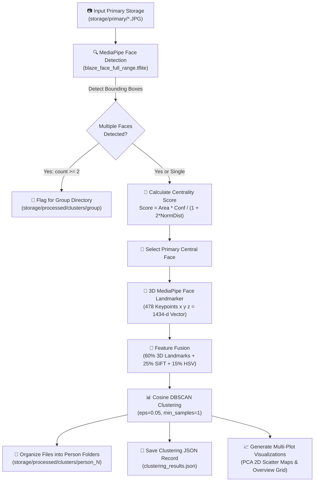

# 🔍 ImageCluster: AI-Powered Facial Detection, 3D Landmark Identification & Photo Clustering Pipeline

[](https://www.python.org/)
[](https://developers.google.com/mediapipe)
[](https://opencv.org/)
[](https://scikit-learn.org/)
[]()

**ImageCluster** is an advanced Python-based computer vision and machine learning engine that automatically detects faces, extracts **478 3D facial landmarks**, prioritizes **central main subjects**, performs unsupervised **DBSCAN clustering** by person identity, separates multi-person photos into a dedicated **`group`** directory, and renders **multi-panel cluster map visualizations**.

---

## 📍 Current Project Position & Status

| Feature / Module | Status | Description |
| :--- | :---: | :--- |
| **Full-Range Face Detection** | ✅ Completed | MediaPipe BlazeFace Full-Range model tuned for high-resolution DSLR images (32+ MP) |
| **Short-Range Fallback** | ✅ Completed | Secondary fallback model for selfie and close-up face detection |
| **3D Face Landmark Identification** | ✅ Completed | Extracts 478 normalized 3D keypoints $(x, y, z)$ per face and renders landmark mesh overlays |
| **Central Person Prioritization** | ✅ Completed | Spatial centrality scoring algorithm prioritizes the primary central subject in multi-face photos |
| **DBSCAN Person Clustering** | ✅ Completed | Cosine-metric DBSCAN clustering groups photos into distinct person folders (`person_1`, `person_2`, ...) |
| **Multi-Face Group Organization** | ✅ Completed | Photos containing 2+ detected faces are automatically routed into `storage/processed/clusters/group` |
| **Clustering JSON Records** | ✅ Completed | Exports complete mapping metrics, cluster statistics, and image history to `clustering_results.json` |
| **Multi-Plot Visualization** | ✅ Completed | Generates 2D PCA scatter graphs, folder circle maps, individual person maps, and multi-panel overview grids |

---

## 🏗️ System Architecture & Workflow Diagram



---

## 🔬 Core Capabilities

### 1. 🎯 Central Person Selection Algorithm
When an image contains multiple people, standard clustering engines duplicate the image across every detected person. ImageCluster calculates a **Spatial Centrality Score**:

$$\text{Centrality Score} = \frac{\text{Face Area} \times \text{Confidence Score}}{1.0 + 2.0 \times \text{Normalized Distance to Image Center}}$$

This ensures each photo is clustered according to its **primary main subject**, while multi-face images are also archived in the `group` folder.

### 2. 📐 3D Facial Landmark Identification (478 Keypoints)
MediaPipe `FaceLandmarker` extracts **478 3D landmark points** per face. These points are normalized for scale, rotation, and translation invariance:
- Eye & Iris contours
- Lip & Mouth boundary geometry
- Nose bridge & facial contour mesh

### 3. 📊 Visual Cluster Maps
The system automatically projects high-dimensional face feature vectors down to 2D using PCA and generates:
- **`cluster_map_folders.png`**: Overall 2D PCA scatter map with translucent cluster folder circles.
- **`clustering_plot.png`**: Standard PCA cluster scatter graph with face annotations.
- **`multi_cluster_maps_grid.png`**: Multi-panel overview grid showing side-by-side plots for each individual person cluster.
- **`person_N_cluster_map.png`**: Individual cluster map for every discovered person.

---

## 📁 Repository Directory Structure

```
ImageCluster/
├── .gitignore                      # Git exclusion rules (venv, model binaries, storage caches)
├── README.md                       # Documentation & architecture overview
├── requirements.txt                # Python dependencies
└── backend/
    ├── ai/
    │   ├── cluster.py              # Main clustering execution pipeline
    │   ├── draw_result.py          # Facial landmark mesh drawing utilities
    │   ├── face_detector.py        # Detection, centrality scoring & 3D landmark feature extraction
    │   ├── face_scan.py            # Standalone face detection & landmark visualizer script
    │   ├── file_config.py          # Storage path resolution & image delivery tracker
    │   ├── organizer.py            # File copying to person/group subfolders & JSON recorder
    │   ├── visualizer.py           # PCA scatter plot & multi-cluster map graph generation
    │   └── model/                  # Model storage directory (auto-downloaded)
    │       ├── blaze_face_full_range.tflite
    │       ├── blaze_face_short_range.tflite
    │       └── face_landmarker.task
    └── storage/
        ├── delivered_images.json   # History log of processed images
        ├── primary/                # Input un-clustered image gallery (*.JPG, *.PNG)
        └── processed/
            ├── clustering_results.json
            ├── cluster_map_folders.png
            ├── clustering_plot.png
            ├── cluster_maps/
            │   ├── multi_cluster_maps_grid.png
            │   └── person_X_cluster_map.png
            └── clusters/
                ├── group/          # Images containing 2+ faces
                ├── person_1/       # Distinct Person 1 images
                ├── person_2/       # Distinct Person 2 images
                └── person_N/
```

---

## 🚀 Installation & Setup Guide

### 1. Prerequisites
- **Python 3.10+** installed
- **Git** installed

### 2. Environment Setup
Clone the repository and initialize a Python virtual environment:

```bash
# Clone the repository
git clone https://github.com/CodeBlue0001/ImageCluster.git
cd ImageCluster

# Create virtual environment
python -m venv .venv

# Activate virtual environment
# Windows (PowerShell):
.\.venv\Scripts\Activate.ps1
# Linux / macOS:
source .venv/bin/activate

# Install dependencies
pip install -r requirements.txt
```

---

## 💻 Running the Pipelines

### 1. Run Facial Scan & 3D Landmark Visualization
To test face detection and visualize the **478 3D landmark mesh** overlay on input images:

```bash
python backend/ai/face_scan.py
```

### 2. Run Main Image Facial Clustering & Organization Pipeline
To process all un-clustered photos in `backend/storage/primary/`, cluster images by person identity, copy files into `person_N` and `group` folders, and render visual graph maps:

```bash
python backend/ai/cluster.py
```

---

## 📊 Output Artifacts & Visualizations

After running `cluster.py`, all outputs are saved in `backend/storage/processed/`:

- **JSON Summary (`clustering_results.json`)**: Contains total face count, discovered person count, group image list, and full mapping.
- **Folder Cluster Map (`cluster_map_folders.png`)**:
  
  

- **Multi-Person Cluster Grid (`cluster_maps/multi_cluster_maps_grid.png`)**:
  
  

---

## 🛠️ Technology Stack

- **Computer Vision**: OpenCV (`cv2`), Google MediaPipe Tasks API (`vision.FaceDetector`, `vision.FaceLandmarker`)
- **Machine Learning**: `scikit-learn` (`DBSCAN`, `PCA`, `StandardScaler`), `numpy`
- **Data Visualization**: `matplotlib`
- **File & System Management**: `pathlib`, `shutil`, `json`

---

## 📝 License & Acknowledgments
Distributed under the MIT License. Models provided by [Google MediaPipe](https://developers.google.com/mediapipe).
# ImageCluster

