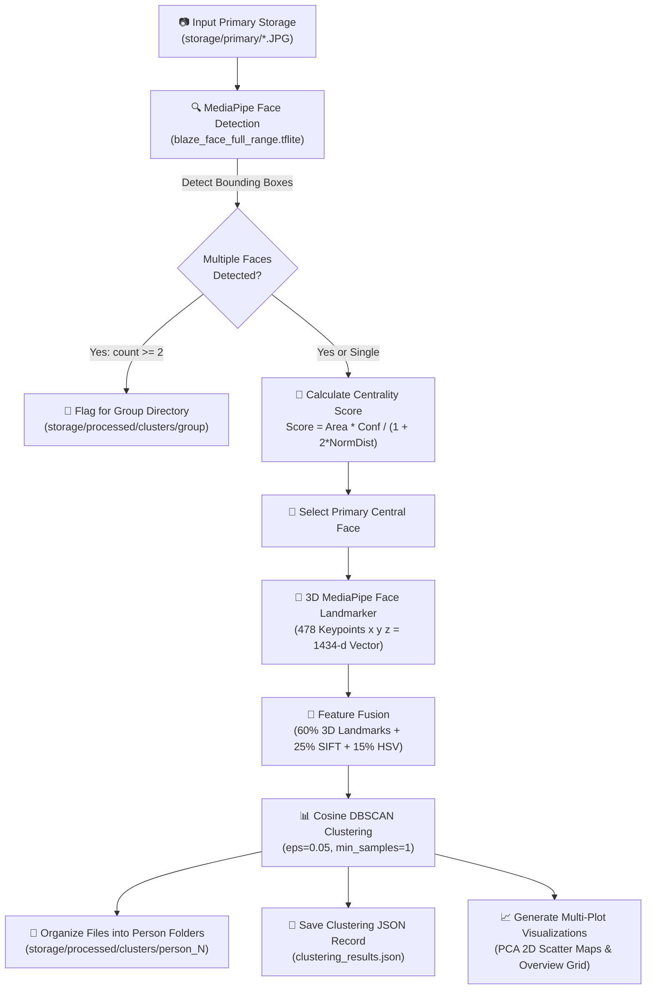

# 🔍 ImageCluster: AI-Powered Facial Detection, 3D Landmark Identification & Photo Clustering Pipeline

[](https://www.python.org/)
[](https://developers.google.com/mediapipe)
[](https://opencv.org/)
[](https://scikit-learn.org/)
[]()

**ImageCluster** is an advanced Python computer vision and machine learning engine that automatically detects faces in photos, extracts **478 3D facial landmarks**, prioritizes **central main subjects**, performs unsupervised **DBSCAN clustering** by person identity, routes multi-person photos into a dedicated **`group`** folder, and renders **multi-panel cluster map visualizations**.

---

## 📁 Repository Directory Structure & File Descriptions

```
ImageCluster/
├── .gitignore                      # Git configuration to exclude virtualenv, model binaries & storage caches
├── README.md                       # Complete documentation, architecture & file descriptions
├── requirements.txt                # Required Python dependencies
└── backend/
    ├── ai/
    │   ├── cluster.py              # Main end-to-end facial clustering & file organization pipeline
    │   ├── draw_result.py          # MediaPipe drawing utilities for rendering facial landmark meshes
    │   ├── face_detector.py        # Central face detection, 3D landmark feature extraction & centrality scoring
    │   ├── face_scan.py            # Standalone visual testing script for face detection & landmark scanning
    │   ├── file_config.py          # Path resolution manager & image delivery tracking history
    │   ├── organizer.py            # File system organizer for person/group folders & JSON result recorder
    │   ├── visualizer.py           # 2D PCA scatter plot & multi-cluster map graph generation engine
    │   └── model/                  # Model storage directory (auto-downloaded if missing)
    │       ├── blaze_face_full_range.tflite # MediaPipe BlazeFace Full-Range model (DSLR / distance detection)
    │       ├── blaze_face_short_range.tflite# MediaPipe BlazeFace Short-Range model (selfie / close range)
    │       └── face_landmarker.task         # MediaPipe 3D Face Landmarker task model (478 3D keypoints)
    └── storage/
        ├── delivered_images.json   # History tracker storing file names of already processed images
        ├── primary/                # Input un-clustered image gallery (*.JPG, *.PNG)
        └── processed/              # Generated output storage directory
            ├── clustering_results.json      # Structured JSON report of discovered clusters & face metadata
            ├── cluster_map_folders.png      # 2D PCA scatter plot with enclosing cluster folder circles
            ├── clustering_plot.png          # Standard annotated 2D PCA cluster scatter plot
            ├── cluster_maps/                # Directory containing individual & grid cluster maps
            │   ├── multi_cluster_maps_grid.png # Multi-panel overview grid of all person clusters
            │   ├── person_1_cluster_map.png   # Individual cluster map for Person 1
            │   └── person_N_cluster_map.png   # Individual cluster map for Person N
            └── clusters/                    # Sorted output directories organized by person identity
                ├── group/          # Folder storing images featuring 2+ detected people
                ├── person_1/       # Images where Person 1 is the primary main subject
                ├── person_2/       # Images where Person 2 is the primary main subject
                └── person_N/       # Images where Person N is the primary main subject
```

### 📄 Detailed File Descriptions

#### 1. `backend/ai/cluster.py`
- **Role**: Main Pipeline Controller.
- **Functionality**:
  - Iterates through un-processed images from primary storage.
  - Calls `detect_faces_with_central_priority()` to extract 3D landmark feature vectors for the main subject of each image.
  - Flags photos containing $\ge 2$ faces for the `group` folder.
  - Runs **DBSCAN cosine clustering** (`eps=0.05`) across all central facial feature embeddings.
  - Invokes `organizer.py` to copy images into `person_1/`, `person_2/`, ... and `group/` subfolders.
  - Exports complete JSON metadata via `save_clustering_results()`.
  - Invokes `visualizer.py` to generate 2D PCA scatter plots, folder circle maps, individual person maps, and multi-panel grid figures.

#### 2. `backend/ai/face_detector.py`
- **Role**: Core Vision & Landmark Feature Extraction Engine.
- **Functionality**:
  - Initializes MediaPipe `FaceDetector` (`blaze_face_full_range.tflite` with `blaze_face_short_range.tflite` fallback).
  - Initializes MediaPipe `FaceLandmarker` (`face_landmarker.task`).
  - Implements `extract_face_embedding()`: Fuses **478 3D facial landmark coordinates** ($1434$-d vector, 60%), **SIFT geometric keypoints** ($128$-d vector, 25%), and **HSV color histogram** ($256$-d vector, 15%).
  - Implements `detect_faces_with_central_priority()`: Computes spatial centrality score to select the primary central person in multi-face photos.

#### 3. `backend/ai/face_scan.py`
- **Role**: Interactive Face & Landmark Visualizer Script.
- **Functionality**:
  - `create_from_option()`: Runs face detection, draws bounding boxes, displays image via `cv2_imshow()`, and returns `(mp_image, face_detector_result)`.
  - `face_landmark_identification()`: Extracts 478 3D facial landmarks, overlays landmark mesh (tessellation, contours, iris connections), and displays annotated images.

#### 4. `backend/ai/draw_result.py`
- **Role**: MediaPipe Drawing Helper Module.
- **Functionality**:
  - Implements `draw_landmarks_on_image()` using MediaPipe `drawing_utils` and `drawing_styles`.
  - Renders facial mesh tessellation, facial contour lines, and iris connection overlays onto NumPy image arrays.

#### 5. `backend/ai/organizer.py`
- **Role**: File Organizer & JSON Metric Recorder.
- **Functionality**:
  - `organize_images_by_cluster()`: Automatically creates `person_N/` subfolders and a `group/` folder under `storage/processed/clusters/`, copying input images to their destination directories.
  - `save_clustering_results()`: Exports total face counts, cluster metrics, group image lists, and per-person file mappings to `clustering_results.json`.

#### 6. `backend/ai/visualizer.py`
- **Role**: Cluster Graph & Map Generator.
- **Functionality**:
  - Performs 2D PCA dimensionality reduction on high-dimensional facial landmark feature vectors.
  - `draw_cluster_map_with_folders()`: Generates scatter plot with translucent folder circles around clusters.
  - `draw_standard_cluster_plot()`: Renders color-coded PCA scatter plot with image annotations.
  - `create_multiple_cluster_maps()`: Generates individual per-person cluster maps (`person_N_cluster_map.png`) and a combined multi-panel overview grid figure (`multi_cluster_maps_grid.png`).

#### 7. `backend/ai/file_config.py`
- **Role**: Configuration & Path Resolution Manager.
- **Functionality**:
  - Defines project path constants (`BASE_DIR`, `PRIMARY_STORAGE`, `PROCESSED_STORAGE`, `CLUSTERS_STORAGE`, `TRACK_FILE`).
  - `get_image()`: Sequentially yields un-processed image paths from `storage/primary/`.
  - `record_delivered()` / `get_delivered_records()`: Tracks history in `delivered_images.json` to prevent duplicate processing.

---

## 📍 Current Project Position & Status

| Module / Feature | Status | Description |
| :--- | :---: | :--- |
| **Full-Range Face Detection** | ✅ Completed | MediaPipe BlazeFace Full-Range model tuned for high-resolution DSLR photos (32+ MP) |
| **Short-Range Fallback** | ✅ Completed | Secondary fallback model for close-up and selfie distance detection |
| **3D Face Landmark Identification** | ✅ Completed | Extracts 478 normalized 3D keypoints $(x, y, z)$ per face and renders mesh overlays |
| **Central Person Prioritization** | ✅ Completed | Spatial centrality scoring algorithm selects primary main subject in multi-face photos |
| **DBSCAN Person Clustering** | ✅ Completed | Cosine-metric DBSCAN clustering groups photos into distinct person folders (`person_1`, `person_2`, ...) |
| **Multi-Face Group Organization** | ✅ Completed | Photos containing 2+ detected faces are automatically copied into `storage/processed/clusters/group` |
| **Clustering JSON Records** | ✅ Completed | Exports complete mapping metrics, cluster statistics, and image history to `clustering_results.json` |
| **Multi-Plot Visualization** | ✅ Completed | Generates 2D PCA scatter graphs, folder circle maps, individual person maps, and multi-panel overview grids |

---

## 🏗️ System Architecture & Workflow



---

## 🔬 Key Algorithms & Formulas

### 1. 🎯 Central Person Selection Formula
When an image contains multiple people, ImageCluster calculates a **Spatial Centrality Score** for each face:

$$\text{Centrality Score} = \frac{\text{Face Area} \times \text{Confidence Score}}{1.0 + 2.0 \times \text{Normalized Distance to Image Center}}$$

The face with the highest score is selected as the main subject for person clustering, ensuring each photo belongs to its primary central person.

### 2. 📐 3D Facial Landmark Feature Fusion
MediaPipe `FaceLandmarker` extracts **478 3D landmark points** per face. Coordinates are centered and scale-normalized to achieve translation and scale invariance:
- $1434$-d normalized 3D landmark geometric vector (60% weight)
- $128$-d SIFT structural vector (25% weight)
- $256$-d HSV color histogram vector (15% weight)

---

## 🚀 Installation & Quick Start

### 1. Environment Setup
```bash
# Clone the repository
git clone https://github.com/CodeBlue0001/ImageCluster.git
cd ImageCluster

# Create & activate virtual environment
python -m venv .venv
# Windows (PowerShell):
.\.venv\Scripts\Activate.ps1
# Linux / macOS:
source .venv/bin/activate

# Install dependencies
pip install -r requirements.txt
```

### 2. Running Scripts

- **Facial Landmark Scanner & Visualizer**:
  ```bash
  python backend/ai/face_scan.py
  ```

- **Main Image Clustering & File Organization Pipeline**:
  ```bash
  python backend/ai/cluster.py
  ```

---

## 📊 Output Artifacts & Visualizations

Output graph plots and records are saved in `backend/storage/processed/`:

- **Folder Cluster Map (`cluster_map_folders.png`)**:
  
  

- **Multi-Person Cluster Grid (`cluster_maps/multi_cluster_maps_grid.png`)**:
  
  

---

## 🛠️ Tech Stack & License

- **Vision & ML**: MediaPipe Tasks API (`FaceDetector`, `FaceLandmarker`), OpenCV (`cv2`), `scikit-learn` (`DBSCAN`, `PCA`, `StandardScaler`), `numpy`
- **Visualization & Logging**: `matplotlib`, `json`, `pathlib`, `shutil`
- **License**: MIT License# ImageCluster

